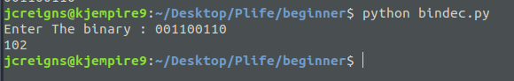

### BIN2DEC
## Done in python
This part of my @100daysOfCode.
I followed this link [ here](https://github.com/florinpop17/app-ideas) and found some cool projects ideas to improve my skills in Python.

**BIN2DEC** was the first of many projects arranged in order of difficulty and expertise.

It is just a simple program that **converts binary numbers to decimal** or mathematically, base 2 numbers to base 10 numbers.

```
 python bindec.py
 ```

 Run that command for python2 and
```
python3 bindec.py
```
for python3.


